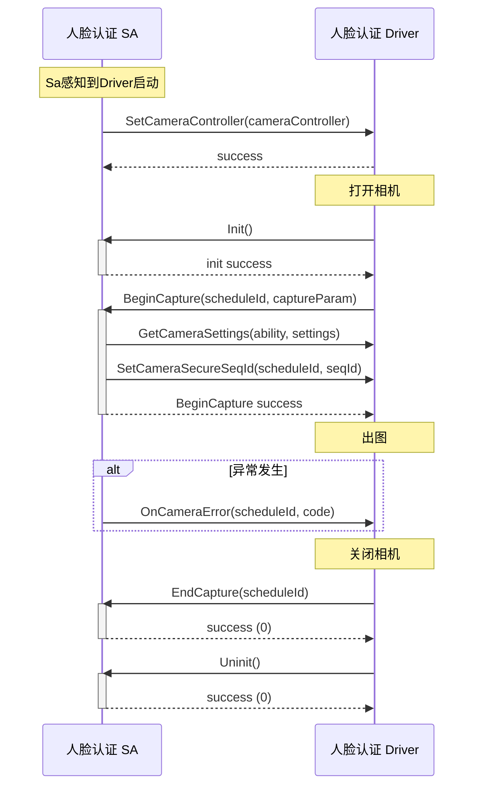

# 人脸认证 HDI v3_0 接口评审文档

##  背景

架构优化要求减少非必要的chipset sdk，当前人脸认证芯片组件使用Chipset SDK机制通过SA调用相机。

修改前：


修改后：


## 接口使用流程




## 修改内容

### IFaceAuthInterface新增 4 个方法

```C++
// 服务启动时设置相机控制器
SetCameraController([in] ICameraControllerCallback cameraController);
// 驱动在 BeginCapture 期间调用，协商相机参数
GetCameraSettings([out] unsigned char[] cameraAbility, [out] unsigned char[] cameraSettings);
// 驱动在 BeginCapture 期间调用，设置安全序列号
SetCameraSecureSeqId([in] unsigned long scheduleId, [in] unsigned long secureSeqId);
// 驱动在收到异常时调用错误通知
OnCameraError([in] unsigned long scheduleId, [in] int resultCode);
```

## 新增接口

### 新增ICameraControllerCallback 回调接口

```C++
[callback] interface ICameraControllerCallback {
	// 初始化相机硬件
    Init();
    // 反初始化相机硬件
    Uninit();
    // 启动相机捕获会话
    BeginCapture([in] unsigned long scheduleId, [in] CaptureParam captureParam, [out] int resultCode);
    // 结束相机捕获会话
    EndCapture([in] unsigned long scheduleId);
    // 执行命令(主要定位数据相关)
    ProcessCommand([in] int commandId, [in] unsigned char[] input, [out] unsigned char[] output);
}
```

### CaptureStream 结构体

```idl
struct CaptureStream {
    boolean isSecure;  // 是否为安全流
    int format; // 图像格式
    int width; // 宽度（像素）
    int height;  // 高度（像素）
    BufferProducerSequenceable bufferProducer;  // 图像缓冲区
}
```

**用途**：描述单个相机输出流的配置，支持多流并行输出

### CaptureParam 结构体

```idl
struct CaptureParam {
    boolean needPreview; // 是否需要预览
    int tokenId; // 认证请求令牌ID
    CaptureStream[] streams; // 输出流数组
}
```

**用途**：聚合相机捕获的所有配置参数

